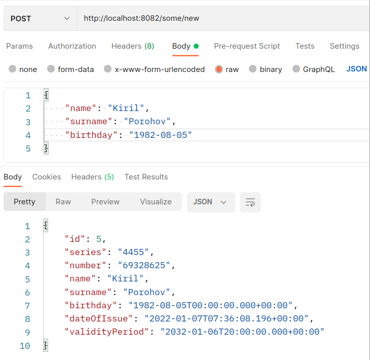
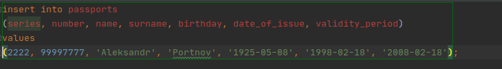
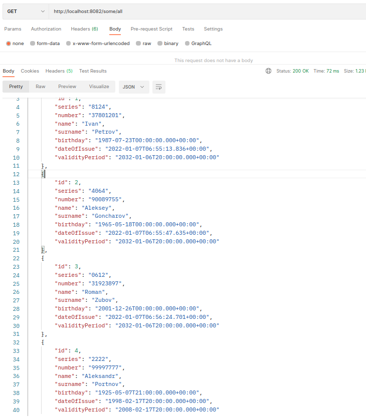
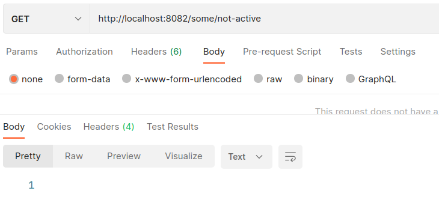
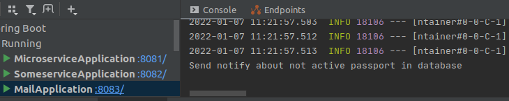

# Приложение Microservice

## О проекте
Учебный проект - Микросервисы.
Решаемые задачи:
Асинхронное взаимодействие сервисов через брокер сообщений Kafka.
Взаимодействие рассматривается на примере приложения, работающего с базой данных паспортов.

Основная цель:
При появлении в базе данных паспорта с истёкшим сроком действия, модуль Mircoservice, отправляет
сообщение в тему "mail" брокера Kafka. Модуль Mail отслеживает данную тему и при появлении нового
сообщения посылает уведомление об истёкшем сроке действия (функционал упрощен).
Управление приложением осуществляется через модуль Someservice, все управляющие запросы идут от данного модуля.

## Сборка 
JDK14, Maven, Spring Boot, PostgreSQL, Liquibase, Kafka

## Как пользоваться 
Заполняем базу данных необходимым количеством записей.

В ручном режиме добавляем в базу запись паспорта с истёкшим сроком действия.

Проверяем наличие всех записей в базе данных:

Далее осуществляем запрос на наличие в базе просроченных паспортов:

При положительном ответе, в сервисе Mail сработает триггер, и сервис отправит уведомление.

 

## Контакты.
Кутявин Владимир Анатольевич

skype: tribuna87

email: tribuna87@mail.ru

telegram: @kutiavinvladimir